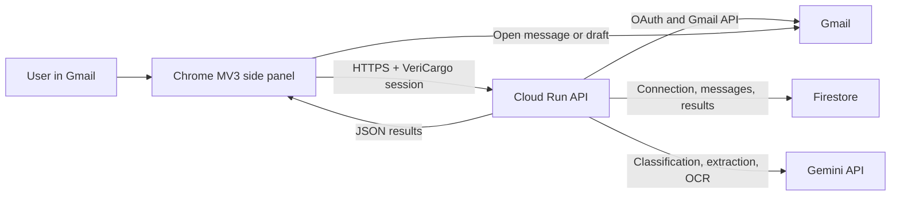

# VeriCargo Gmail Shipping Assistant

VeriCargo is an AI-assisted Chrome extension for logistics email triage and Shipping Instruction (SI) versus Draft Bill of Lading (Draft BL) verification. It runs in Chrome's side panel beside Gmail, synchronizes an authorized Inbox through a Cloud Run backend, classifies logistics emails, processes shipping documents, compares seven canonical fields, and routes uncertain cases to a human reviewer.

The active product is the Manifest V3 extension in [`chrome-extension/`](chrome-extension/), backed by the Node.js service in [`cloud-run-api/`](cloud-run-api/). The Next.js application at the repository root is an earlier fixture-backed workflow prototype and remains useful for UI development and deterministic workflow tests; it is not the data source used by the extension.

> VeriCargo provides AI-assisted suggestions for human review. Users must verify all extracted, normalized, compared, and generated information against the original source documents before confirming or sending it.

## Contents

- [Current status](#current-status)
- [Product workflow](#product-workflow)
- [Features](#features)
- [Normalization and comparison rules](#normalization-and-comparison-rules)
- [Architecture and data flow](#architecture-and-data-flow)
- [Repository structure](#repository-structure)
- [Prerequisites](#prerequisites)
- [Load the Chrome extension](#load-the-chrome-extension)
- [Run the Cloud Run API locally](#run-the-cloud-run-api-locally)
- [Google Cloud and OAuth configuration](#google-cloud-and-oauth-configuration)
- [Deploy the backend](#deploy-the-backend)
- [Testing](#testing)
- [Chrome Web Store packaging](#chrome-web-store-packaging)
- [Chrome Web Store privacy declarations](#chrome-web-store-privacy-declarations)
- [GitHub Pages, privacy, and terms](#github-pages-privacy-and-terms)
- [Demonstration video checklist](#demonstration-video-checklist)
- [Security and privacy notes](#security-and-privacy-notes)
- [Troubleshooting](#troubleshooting)
- [Known limitations](#known-limitations)
- [Earlier web prototype](#earlier-web-prototype)
- [License and contact](#license-and-contact)

## Current status

- Chrome extension version: `0.9.34`
- Manifest version: `3`
- Minimum Chrome version: `114`
- Chrome Web Store: [Install or open VeriCargo](https://chrome.google.com/webstore/detail/oibohododddnipfbkoflhmbfkfbmogpj)
- Store listing status: available through the direct link; Chrome Web Store search indexing may still be pending
- Backend service: `vericargo-api`
- Cloud Run region: `asia-southeast1`
- Backend URL: `https://vericargo-api-8562721906.asia-southeast1.run.app`
- Persistence: Google Cloud Firestore
- AI processing: Google Gemini, configured only on the backend
- Mailbox source: the authorized Gmail Inbox; there is no mock mailbox or Demo mode in the extension
- Automatic synchronization: incremental Gmail history synchronization every 60 seconds while the side panel is open

The project is currently a student hackathon system under active development. It is suitable for approved testers, demonstrations, and evaluation, but it has not completed all production OAuth, security-assessment, operational, retention, and support requirements.

## Product workflow

The extension presents four tabs in this order:

1. **Inbox Summary** — category totals, document-workflow totals, and processing status.
2. **My Cases** — searchable and filterable Gmail cases with email content, attachments, classifications, confidence, and direct Gmail navigation.
3. **SI/BL Document Comparison** — processed comparison cases, Pending/Complete review filters, field evidence, normalized values, Draft BL generation, and review completion.
4. **Human Review** — Email Intent Uncertain, Missing/Ambiguous Document, and Unreadable/Low Quality queues.

The end-to-end processing sequence is:

1. The user explicitly connects an allowed Google account.
2. Cloud Run completes Google OAuth and stores the encrypted refresh token in Firestore.
3. The initial synchronization imports Gmail Inbox messages in resumable batches.
4. Gemini classifies each email into one of six categories.
5. VeriCargo creates or updates the corresponding top-level Gmail category label.
6. Document Comparison messages enter document identification and extraction.
7. One SI and one Draft BL are selected, parsed, normalized, and compared field by field.
8. Ready cases appear in the SI/BL comparison queue; missing, ambiguous, or unreadable documents enter Human Review.
9. The user reviews the evidence, prepares a normalized Draft BL or response draft, and records the final review state.

## Features

### Gmail synchronization

- Imports only messages currently in the Gmail Inbox.
- Performs a full import for the initial connection, then uses Gmail `history.list` for incremental updates.
- Automatically checks for changes every minute without replacing the current view, selection, scroll position, or in-progress Draft BL edit.
- Imports new and restored Inbox messages.
- Removes extension records when their Gmail messages are archived, moved to Spam or Trash, or deleted.
- Falls back safely to a full synchronization if the stored Gmail history cursor has expired.
- Provides a manual **Refresh** action in addition to automatic synchronization.
- Opens selected messages in the original Gmail tab through **View Email in Gmail**.

### Email classification and Gmail labels

Every current classification is one of:

| Internal category | User-facing Gmail label |
| --- | --- |
| `DOCUMENT_COMPARISON` | Document Comparison |
| `NEW_SI` | New SI Requests |
| `INVOICE_QUERY` | Invoice Queries |
| `GENERAL` | General Messages |
| `SPAM` | Spam Email |
| `HUMAN_REVIEW` | Email Intent Uncertain |

`Spam Email` is used because Gmail reserves the system label name `SPAM`.

The backend creates the six top-level labels, applies the configured label color, migrates older `VeriCargo/<category>` and `VeriCargo - <category>` labels, removes obsolete VeriCargo category labels, and preserves unrelated Gmail labels. Gmail supports only a predefined label-color palette, so some Gmail colors are the nearest supported shade rather than the exact UI RGB value.

Label synchronization is bidirectional:

- A category selected in VeriCargo updates the Gmail label.
- A supported category-label change made in Gmail is imported into VeriCargo during synchronization.
- Human decisions are marked as manual and are not overwritten by later automatic classification.
- Resolved intent-review cases retain an undo snapshot so **Revoke label change** can restore the previous classification and Gmail label.

### Document identification and extraction

- Processes only emails classified as Document Comparison.
- Identifies one Shipping Instruction and one Draft Bill of Lading.
- Uses lightweight parsing for machine-readable text, PDFs, and XLSX workbooks.
- Uses Gemini Vision/OCR for scanned PDFs and images.
- Sends at most two supported attachments to the second, attachment-assisted classification pass when email text and metadata are insufficient.
- Records an unsupported or invalid attachment as an Unreadable/Low Quality outcome instead of stopping the entire mailbox workflow.
- Stores filenames, document type, extraction method, confidence, raw values, normalized values, page/location references, and evidence snippets.

### Seven-field SI/BL comparison

VeriCargo compares exactly these fields:

1. Shipper
2. Consignee
3. Notify Party
4. Port of Loading
5. Port of Discharge
6. Container Count
7. Gross Weight in kilograms

Each field is returned as `MATCH`, `MISMATCH`, or `UNRESOLVED`. The overall result is:

- `MISMATCH` when at least one field mismatches;
- `NEEDS_REVIEW` when there is no mismatch but at least one field is unresolved; or
- `MATCH` when all seven fields match.

Overall comparison confidence is the rounded mean of the seven field confidences. The interface displays:

- below 50% in red;
- 50–79% in yellow; and
- 80–100% in green.

Normalized/corrected text is displayed prominently. Original attachment text is displayed as secondary grey evidence so the reviewer can see what the document actually contained.

### Draft BL review and generation

- Builds a normalized Draft BL by preferring normalized SI values and falling back to Draft BL values when the SI value is unavailable.
- Provides an editable text area with browser spellcheck.
- Detects structured shipping-field edits that differ from the normalized comparison and offers review suggestions.
- Detects likely keyboard smashing, repeated sequences, abnormal word patterns, excessive symbol sequences, and unexpected text after the VeriCargo footer.
- Disables Download, Compose, and Complete while likely gibberish remains.
- Repeats gibberish validation on the backend, preventing direct API requests from generating an affected attachment.
- Limits reviewed Draft BL text to 20,000 characters.
- Generates TXT, PDF, or DOCX downloads.
- Creates a concise, sender-addressed Gmail draft and attaches the normalized file; it does not automatically send the email.
- Supports **Reset to normalized**.
- Keeps comparison review status in yellow **Pending** and green **Complete** queues, with a reversible status button.

The gibberish check is intentionally conservative and heuristic. It is not a general semantic truth detector; valid company names, ports, booking references, and shipping identifiers remain possible and should always be reviewed by a person.

### Human Review

Human Review has three issue filters:

1. **Email Intent Uncertain**
   - Presents valid category buttons for a human decision.
   - Updates the Gmail label immediately.
   - Splits the left-hand list into independently scrollable yellow Pending and green Reviewed sections.
   - Shows the assigned category on reviewed rows.
   - Keeps the reviewed email selectable and exposes **Revoke label change** at the top of its detail view.

2. **Missing/Ambiguous Document**
   - Explains which required SI or Draft BL could not be identified.
   - Generates an editable, sender-aware request for corrected documents.
   - Capitalizes normal sender names and uppercases one- or two-character initials.
   - Creates the response as a Gmail draft only after the user selects the compose action.
   - Remains in the single Missing/Ambiguous Document queue after the response draft is created, so the case stays visible until its source email or workflow status changes.

3. **Unreadable/Low Quality**
   - Identifies which document could not be read reliably.
   - Generates an editable request for readable replacement documents.
   - Uses the same editable Gmail response-draft workflow as missing documents and remains in the single Unreadable/Low Quality queue.

## Normalization and comparison rules

Normalization is deterministic; the current system does not perform unsupervised learning and does not train itself from reviewer changes. Gemini provides classification and semantic extraction, while comparison uses explicit canonical rules so results remain testable and reproducible.

### Field-name aliases

Examples include:

- `shipper`, `exporter`, and `shipper/exporter` → Shipper
- `consignee` and `receiver` → Consignee
- `notify`, `notify party`, and `intermediate notify` → Notify Party
- `port of loading`, `loading port`, and `POL` → Port of Loading
- `port of discharge`, `discharge port`, and `POD` → Port of Discharge
- `container count`, `number of containers`, and `no. of containers` → Container Count
- `gross weight`, `gross weight kg`, and `gross wt` → Gross Weight (kg)

### Text and party values

- Applies Unicode compatibility decomposition.
- Removes combining accents for comparison.
- Collapses tabs, newlines, and repeated whitespace.
- Converts comparison text to uppercase.
- Replaces punctuation with normalized spaces.
- Party fields currently require equality after this canonical text cleanup; the comparison engine does not infer that unrelated company names are equivalent.

### Ports

Port labels such as `POL`, `POD`, `Loading Port`, and `Discharge Port` are removed before comparing values. Current explicit aliases include:

- Singapore / `SGSIN`
- Pyeongtaek or Pyongtaek, South Korea / `KRPTK`
- Busan or Pusan, South Korea / `KRPUS`
- Ho Chi Minh City or Cat Lai, Vietnam / `VNSGN`
- Nantong, China / `CNNTG`
- Callao, Peru / `PECLL`
- Valparaiso, Chile / `CLVAP`
- Le Havre, France / `FRLEH`
- Mersin, Turkey / `TRMER`

Other ports are compared using cleaned uppercase text unless Gemini has already supplied matching normalized values.

### Container counts

The first numeric value is extracted and normalized. For example, `6 x 40'HC` and `6 containers` both normalize to `6`. Container-count comparison currently has zero numeric tolerance.

### Weights

- Kilograms and `kg`/`kgs` remain kilograms.
- Metric tons, tonnes, tons, and `MT` are multiplied by 1,000.
- Pounds and `lb`/`lbs` are multiplied by `0.45359237`.
- Numeric punctuation such as thousands separators is removed.
- Weight values match within the greater of 0.5 kg or 0.1% of the SI value.

Examples:

| SI value | Draft BL value | Result |
| --- | --- | --- |
| `1 MT` | `1,000 KG` | Match |
| `22 tonnes` | `22,000 KGS` | Match |
| `2,205 LB` | approximately `1,000 KG` | Match within tolerance |
| `3 x 40HC` | `2 containers` | Mismatch |

## Architecture and data flow



### Chrome extension

- `manifest.json` declares only `sidePanel`, `storage`, and the single Cloud Run host permission.
- `service-worker.js` opens the side panel from the toolbar action.
- `cloud-client.js` stores a VeriCargo session token and temporary connection polling token in `chrome.storage.local`, then communicates with the backend over HTTPS.
- `sidepanel.html`, `sidepanel.css`, and `sidepanel.js` implement the interface and workflows.
- No remote JavaScript or WebAssembly is loaded or executed. The backend returns data and processing results, not executable code.

### Cloud Run API

- Implements OAuth, authenticated extension sessions, Gmail synchronization, label management, attachment access, classification, document processing, comparison review status, Draft BL generation, and Gmail draft creation.
- Uses Google Cloud Firestore for connection records, encrypted refresh tokens, synchronized messages, classifications, extracted document fields, comparisons, and workflow state.
- Keeps the OAuth client secret and Gemini API key on the backend; neither is included in the extension package.
- Runs as the non-root `node` user in the production container.

### Backend routes

| Method and route | Purpose |
| --- | --- |
| `GET /health` | Service health check |
| `GET /oauth/start` | Browser OAuth entry point |
| `GET /oauth/callback` | Google OAuth callback |
| `POST /api/connect/start` | Start an extension connection attempt |
| `POST /api/connect/status` | Poll the connection attempt and obtain an extension session |
| `GET /api/connection` | Return the authenticated connection status |
| `POST /api/sync` | Run one resumable Gmail synchronization batch |
| `GET /api/messages` | List synchronized Inbox messages and results |
| `POST /api/labels/sync` | Create/update and apply VeriCargo Gmail labels |
| `GET /api/messages/:id/attachments/:attachmentId` | Retrieve an authorized attachment preview |
| `GET` or `POST /api/messages/:id/bl-file` | Generate TXT, PDF, or DOCX normalized Draft BL content |
| `POST /api/messages/:id/bl-draft` | Create a Gmail draft with the normalized file attached |
| `POST /api/messages/:id/review-status` | Set comparison review status to `PENDING` or `COMPLETE` |
| `POST /api/messages/:id/category` | Resolve an uncertain intent and change its Gmail label |
| `POST /api/messages/:id/category/revoke` | Restore the previous category and Gmail label |
| `POST /api/messages/:id/review-draft` | Create a missing/unreadable-document Gmail response draft |
| `GET /api/classification` | Return Gemini classification configuration/status |
| `POST /api/classify` | Classify the next email batch |
| `GET /api/documents/status` | Return document-processing configuration/status |
| `POST /api/documents/process` | Process the next Document Comparison case |
| `POST /api/disconnect` | Delete the active VeriCargo session |

## Repository structure

```text
chrome-extension/             Chrome MV3 side-panel extension
  assets/                     Extension icons and VeriCargo artwork
  cloud-client.js             Authenticated Cloud Run API client
  manifest.json               Extension manifest and permissions
  service-worker.js           Toolbar-to-side-panel behavior
  sidepanel.html              Side-panel document
  sidepanel.css               Extension styles
  sidepanel.js                UI state and workflow logic

cloud-run-api/                Node.js Cloud Run backend
  src/app.js                  HTTP routes
  src/oauth-service.js        Google OAuth and extension sessions
  src/gmail-service.js        Gmail sync, labels, drafts, and reviews
  src/classification-service.js Gemini email classification
  src/document-service.js     Document identification and extraction
  src/document-comparison.js  Deterministic normalization and comparison
  src/lightweight-parser.js   Text/PDF/XLSX parsing
  src/bl-draft-service.js     TXT/PDF/DOCX generation and gibberish checks
  test/                       Backend unit/integration tests

docs/                         GitHub Pages public site
  index.html                  VeriCargo homepage
  privacy-policy.html         Public privacy policy
  terms-of-service.html       Public terms

app/, features/, domain/      Earlier fixture-backed Next.js prototype
data/fixtures/                Deterministic prototype data
tests/workflow.test.ts        Root workflow tests
```

## Prerequisites

- Node.js `22.13.0` or newer
- npm
- Chrome `114` or newer
- A Google Cloud project with billing as required by the selected services
- Gmail API enabled
- Firestore database enabled
- Cloud Run and Cloud Build enabled for deployment
- A Web application OAuth client
- A 32-byte token-encryption key, base64 encoded
- A Gemini API key when AI classification and document processing are enabled
- An allowed Gmail test account

For hackathon testing, the OAuth application can remain in Testing status and explicitly list teammates, judges, and evaluators as test users. Testing-mode authorizations may expire and require reconnection. A public production launch requires the applicable Google OAuth verification and possibly a restricted-scope security assessment.

## Load the Chrome extension

The published VeriCargo extension is available from the [Chrome Web Store](https://chrome.google.com/webstore/detail/oibohododddnipfbkoflhmbfkfbmogpj). The direct listing is live, although it may not appear in Chrome Web Store search results until indexing is complete.

For local development or testing an unpublished build, use Chrome's **Load unpacked** workflow below.

The committed manifest currently points to the deployed VeriCargo Cloud Run service.

1. Open `chrome://extensions`.
2. Enable **Developer mode**.
3. Select **Load unpacked**.
4. Choose the `chrome-extension` directory—not the repository root.
5. Pin VeriCargo and open its side panel from a Gmail tab.
6. Select **Connect Gmail** and complete authorization using an account included in `ALLOWED_GMAIL_EMAILS` and, when applicable, the OAuth test-user list.
7. Return to the side panel and allow initial synchronization, classification, label application, and document processing to finish.

After changing extension files, select **Reload** on the extension card. Local changes do not require a new backend deployment unless a backend file also changed.

To point the extension at another backend, update both:

- `API_BASE` in `chrome-extension/cloud-client.js`; and
- `host_permissions` in `chrome-extension/manifest.json`.

## Run the Cloud Run API locally

Install backend dependencies:

```bash
cd cloud-run-api
npm ci
```

Provide the required environment variables listed below, authenticate Application Default Credentials for Firestore, and start the service:

```bash
npm start
```

The local health endpoint is:

```text
http://localhost:8080/health
```

Required backend configuration:

| Variable | Purpose |
| --- | --- |
| `GOOGLE_OAUTH_CONFIG_PATH` | Path to the downloaded Web application OAuth JSON file |
| `TOKEN_ENCRYPTION_KEY` | Base64-encoded key that decodes to exactly 32 bytes |
| `ALLOWED_GMAIL_EMAILS` | Comma-separated lowercase Gmail allowlist; `*` permits any authorized account |
| `PUBLIC_BASE_URL` | Public service origin without a trailing slash |

Optional AI configuration:

| Variable | Purpose |
| --- | --- |
| `GEMINI_API_KEY` | Backend-only Gemini API key |
| `GEMINI_MODEL` | Gemini model identifier; defaults to `gemini-3.1-flash-lite` |

Do not commit `.env` files, OAuth client JSON, token-encryption keys, Gemini keys, or other credentials. Relevant secret filenames and environment files are excluded through `.gitignore` and `.dockerignore`.

## Google Cloud and OAuth configuration

1. Create or choose the Google Cloud project.
2. Enable Gmail API, Firestore, Cloud Run, Cloud Build, Secret Manager, and the required Gemini/Generative Language service.
3. Create the Firestore database in an appropriate region.
4. Configure the Google Auth Platform branding, audience, data access, and client.
5. Create a **Web application** OAuth client.
6. Add this redirect URI using the final Cloud Run origin:

   ```text
   https://YOUR-CLOUD-RUN-URL/oauth/callback
   ```

7. Configure `ALLOWED_GMAIL_EMAILS` and OAuth test users for the hackathon audience.
8. Store the OAuth JSON, encryption key, and Gemini API key in Secret Manager or another approved secret mechanism.
9. Publish the GitHub Pages homepage, privacy policy, and terms URLs and add them to the Chrome Web Store and Google Auth Platform fields where required.

The backend currently requests `https://mail.google.com/`. This grants broad Gmail access and is a restricted scope. The implemented read, label-modification, and draft-creation operations should be evaluated against the narrower `https://www.googleapis.com/auth/gmail.modify` scope before production verification. Google requires the narrowest scope that supports current functionality.

## Deploy the backend

Cloud Run can build directly from the backend source directory:

```bash
gcloud run deploy vericargo-api \
  --source cloud-run-api \
  --region asia-southeast1 \
  --project YOUR_GOOGLE_CLOUD_PROJECT
```

The production service must also receive all required environment variables and secret mounts described above. Do not paste secret values into the command history or source tree. After deployment:

1. Record the final HTTPS service URL.
2. Set `PUBLIC_BASE_URL` to that exact origin.
3. Register `<service-url>/oauth/callback` in the OAuth client.
4. Update the extension API base and host permission if the service URL changed.
5. Verify `GET /health`.
6. Reload the extension and test a fresh OAuth connection.

The detailed backend behavior and configuration boundary are also documented in [`cloud-run-api/README.md`](cloud-run-api/README.md).

## Testing

Install root dependencies once:

```bash
npm ci
```

Run extension syntax checks:

```bash
npm run extension:check
```

Run the deterministic root workflow tests:

```bash
npm test
```

Run all backend tests:

```bash
npm test --prefix cloud-run-api
```

Optional checks for the earlier web prototype:

```bash
npm run lint
npm run build
```

The current suites cover normalization, comparison, review routing, reprocessing, export shape, OAuth, Gmail synchronization, Inbox/Trash consistency, bidirectional labels, Draft BL generation, gibberish blocking, classification, attachment-assisted processing, document extraction, human-review drafts, and review status changes.

## Chrome Web Store packaging

Upload one ZIP archive whose root contains `manifest.json`; do not wrap the files inside another `chrome-extension` directory.

Required runtime contents:

```text
manifest.json
sidepanel.html
sidepanel.css
sidepanel.js
cloud-client.js
service-worker.js
assets/
  icon-16.png
  icon-32.png
  icon-48.png
  icon-128.png
  vericargo-full.png
```

`chrome-extension/README.md` and the unused `assets/vericargo-logo.png` are not required in the Web Store package. Do not include the backend, tests, `node_modules`, OAuth credentials, screenshots, or other repository files.

Each uploaded update must have a version in `chrome-extension/manifest.json` greater than the previous Web Store version.

In PowerShell, this creates a ZIP from everything currently in the extension directory:

```powershell
Compress-Archive -Path .\chrome-extension\* `
  -DestinationPath .\VeriCargo-v0.9.34.zip `
  -Force
```

For the smallest production package, stage only the runtime files listed above in a temporary directory before compressing them.

## Chrome Web Store privacy declarations

Keep every dashboard answer consistent with the extension package, backend behavior, Store listing, and public privacy policy.

### Single purpose

VeriCargo's single purpose is logistics email and shipping-document verification within Gmail: it classifies relevant email, identifies SI and Draft BL attachments, extracts and normalizes shipment information, compares the documents, highlights discrepancies, and supports human review.

### Permission justifications

- **`sidePanel`** — displays the document-verification interface beside Gmail so users can review classifications, attachments, comparisons, discrepancies, and Human Review cases without leaving their current workflow.
- **`storage`** — stores a VeriCargo session token and temporary Gmail connection polling token in Chrome local extension storage. It is not used for advertising or browsing-history storage.
- **Host permission** — permits HTTPS requests only to `https://vericargo-api-8562721906.asia-southeast1.run.app/*` for OAuth connection, Gmail synchronization, classification, document processing, attachment previews, review changes, generated files, and user-requested Gmail drafts.

### Remote code

Select **No, I am not using remote code**. All executable JavaScript is packaged with the extension. The Cloud Run service returns data and processing results; the extension does not execute those responses as code and does not load external scripts, use `eval()`, or create functions from fetched strings.

### Data disclosures

Based on the current implementation, disclose at least:

- personally identifiable information, including Google account and sender email addresses;
- authentication information, including OAuth/session tokens—but never Google passwords;
- personal communications, including email subjects, bodies, snippets, and attachments; and
- user activity represented by label decisions, review states, edited drafts, and workflow timestamps.

Also disclose financial/payment information if test or production invoice messages may contain amounts, payment details, or financial documents. The current implementation does not intentionally collect health information, device location, or general web-browsing history.

Only certify the three Limited Use statements when they accurately describe the deployed service and team practices.

## GitHub Pages, privacy, and terms

The public static site is already prepared in [`docs/`](docs/). To publish it:

1. Commit and push the `docs` directory to the default branch.
2. Open the GitHub repository's **Settings → Pages**.
3. Select **Deploy from a branch**.
4. Select the default branch and `/docs` folder.
5. Save and wait for deployment.

Expected URLs:

- Homepage: `https://yucodings.github.io/vericargo_extension/`
- Privacy policy: `https://yucodings.github.io/vericargo_extension/privacy-policy.html`
- Terms: `https://yucodings.github.io/vericargo_extension/terms-of-service.html`

Before publishing, confirm that `vericargo0004@gmail.com` is the correct public support, privacy, and deletion-request contact. Keep the public pages, Chrome Web Store privacy declarations, OAuth consent-screen disclosures, and actual system behavior consistent.

## Demonstration video checklist

Use a test Gmail account and synthetic shipping documents. Do not expose real customer information.

For a Google OAuth review video:

1. Show the VeriCargo homepage, privacy policy, correct name, and branding.
2. Start from a disconnected extension and record the full OAuth flow.
3. Keep the browser address bar visible and the consent-screen language set to English.
4. Expand and show every requested OAuth scope.
5. Demonstrate Gmail read access by synchronizing and opening a test message in VeriCargo.
6. Demonstrate label modification by resolving an Email Intent Uncertain case and showing the matching Gmail label.
7. Demonstrate draft creation by composing a normalized Draft BL email and a missing/unreadable-document response.
8. Show SI/BL normalization, field comparisons, evidence, confidence colors, mismatch handling, and Pending/Complete status.
9. Show Draft BL editing, structured-field suggestions, gibberish blocking, file download, and the attached Gmail draft.
10. Show the Email Intent Uncertain Pending/Reviewed split and **Revoke label change**.
11. Show a new email appearing through incremental synchronization and a trashed test email disappearing.
12. Finish with sign-out, Google-access revocation instructions, and the privacy contact.

Upload the recording as an unlisted YouTube video or an otherwise reviewer-accessible link. Narrate how each requested Gmail capability supports the extension's single purpose. Google OAuth verification is separate from Chrome Web Store review.

## Security and privacy notes

- All extension/backend communication uses the configured HTTPS Cloud Run origin.
- The extension stores only a VeriCargo session token and a temporary OAuth connection polling token in `chrome.storage.local`.
- The OAuth client secret, encrypted Gmail refresh token, and Gemini API key are never included in the extension package.
- Gmail refresh tokens are encrypted before Firestore storage.
- Backend sessions expire after 30 days; signing out deletes the active session and local session token.
- Signing out does not currently revoke Google access or delete the persisted backend connection record. Users can revoke Google access at `https://myaccount.google.com/connections` and request backend deletion through the privacy-policy contact.
- Synced message records are removed when Gmail synchronization determines that their messages are no longer in the Inbox.
- Relevant email text and attachment data may be sent to Gemini for classification, semantic extraction, and OCR.
- The extension does not load remote JavaScript/Wasm, use `eval()`, sell user data, or automatically send Gmail messages.
- The privacy policy includes the Chrome Web Store/Google API Limited Use disclosure.

## Troubleshooting

### Extension changes are not visible

Open `chrome://extensions`, locate VeriCargo, and select **Reload**. Confirm the card shows version `0.9.34`, then close and reopen the side panel.

### Gmail connection is rejected

Confirm that the account appears in both the Google OAuth test-user list and `ALLOWED_GMAIL_EMAILS`. In OAuth Testing status, only configured test users can authorize the application.

### Session expired or API returns 401

Select **Sign out**, reconnect Gmail, and complete OAuth again. Backend extension sessions expire after 30 days, while OAuth Testing authorizations may expire sooner.

### New or removed email has not appeared

Keep the side panel open for the next 60-second incremental synchronization or select **Refresh**. Confirm the Gmail message is in `INBOX`; archived, Spam, Trash, and deleted messages are intentionally excluded.

### Gmail label change has not appeared

Leave the message with exactly one supported VeriCargo category label, then run Refresh or wait for automatic synchronization. Conflicting supported category labels are not treated as an unambiguous category change.

### A relabelled uncertain email is difficult to find

Open **Human Review → Email Intent Uncertain** and use the green Reviewed section. The row displays its assigned category and the detail header exposes **Revoke label change** while an undo snapshot exists.

### Download, Compose, or Complete is disabled

Open the Draft BL panel and correct the red content-quality warning. Likely gibberish or unexpected content after the VeriCargo footer blocks file generation and completion on both the extension and backend.

### Backend returns `Route not found`

Verify that the extension's `API_BASE` and manifest host permission point to the current Cloud Run URL, deploy the latest `cloud-run-api` source, verify `/health`, and reload the extension.

### Automatic processing stops after an error

Inspect the classification or document-processing status shown in the extension. Retry with Refresh after correcting OAuth, Gemini, unsupported-file, or backend configuration errors. One invalid attachment should be isolated as an Unreadable/Low Quality case instead of stopping other mailbox cases.

## Known limitations

- This is a hackathon implementation, not a completed production compliance program.
- The current Gmail scope is broader than the likely minimum required scope and should be narrowed before production verification.
- OAuth Testing status is limited to configured test users and may require users to reconnect after test authorization expiry.
- Automatic synchronization runs only while the side panel is open; Gmail push notifications are not configured.
- The port alias table is explicit and currently covers a limited set of commonly demonstrated ports.
- Normalization is deterministic and does not learn automatically from reviewer corrections.
- Party-name comparison uses canonical text equality and does not maintain a learned organization-identity graph.
- Gibberish detection is heuristic and can neither prove semantic correctness nor detect every possible meaningless edit.
- Draft BL documents are review aids, not official carrier documents.
- Backend disconnect currently ends the active extension session but does not delete the stored connection or revoke the Google refresh token.
- Formal data-retention automation and a self-service backend deletion endpoint are not yet implemented.
- The earlier Next.js prototype still uses local fixtures and should not be confused with the live Gmail extension.

## Earlier web prototype

The repository root also contains a deterministic Next.js workflow prototype with twelve fixture cases. It remains useful for design work, local demonstrations, and tests independent of Gmail credentials.

Run it with:

```bash
npm install
npm run dev
```

Prototype-only routes include:

- `GET /api/export` for the documented fixture export shape; and
- `POST /api/cases/:caseId/verify` for the fixture reprocessing contract.

The prototype exporter implements the documented submission keys, but the canonical `sample_submission.json` referenced by earlier project materials is not present in this workspace. Validate `domain/submission/buildSubmission.ts` against any official competition template before a formal submission.

## License and contact

No open-source license file is currently included. Unless the repository owner adds one, normal copyright restrictions apply.

Project contact: `vericargo0004@gmail.com`
